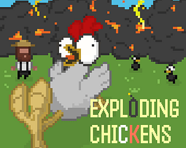
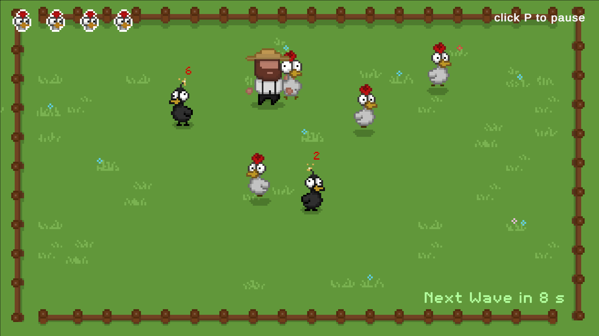
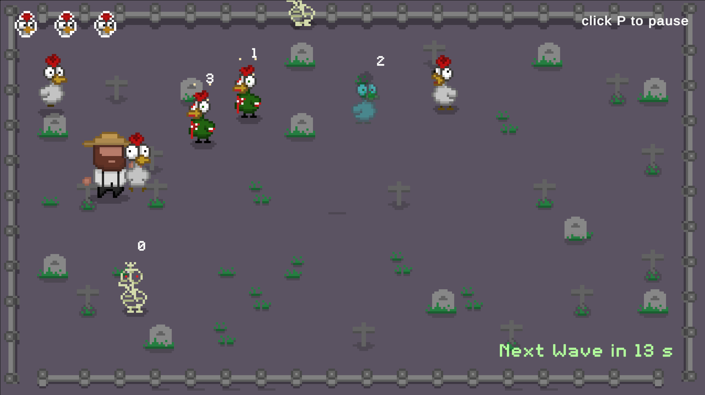
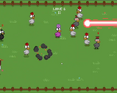
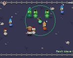
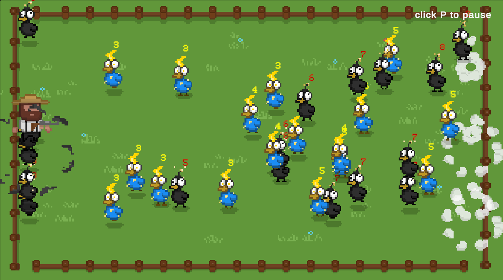

# Exploding Chickens

Play / jam page: https://itch.io/jam/gmtk-jam-2026/rate/4827331

Just a normal chicken farm. A chaotic GMTK Game Jam 2026 entry (and ongoing prototype) where countdown chickens, waves, and special flock types pile on while you grab, drop, and scramble to keep something alive.

Three maps (Farm, Dusk, Graveyard), Story and Chaos modes, a large chicken roster, and map music / SFX throughout.



## GMTK Game Jam 2026 results

Ranked from 52 ratings. Score is adjusted from raw score by the median number of ratings per game in the jam.

| Criteria | Rank | Score | Raw Score |
| -------- | ---- | ----- | --------- |
| Creativity | #842 | 4.077 | 4.077 |
| Audio | #2093 | 3.288 | 3.288 |
| Artwork | #2171 | 3.654 | 3.654 |
| Enjoyment | #2330 | 3.423 | 3.423 |
| Narrative | #3966 | 2.558 | 2.558 |

Source: [jam ratings page](https://itch.io/jam/gmtk-jam-2026/rate/4827331)

## Gameplay











## How to play

| Action | Input |
| ------ | ----- |
| Move | WASD / arrows |
| Grab / drop | Space or E |
| Fire held laser / gun | Space or E (hold for bursts) |
| Pause | P |

**Story:** Protect your flock through timed waves. Bombs and other threats explode or attack on countdowns. Lose every protected chicken and the run ends. Combo chains Farm, Dusk, and Graveyard; single-map Story is endless until wipe.

**Chaos:** Survive a rush of marching bombs (and later electrics) with a gun, locked to a vertical lane.

More detail: [docs/CONTROLS.md](docs/CONTROLS.md)

## Chicken roster (summary)

| World | Allies | Threats |
| ----- | ------ | ------- |
| Farm | Regular, Panic | Bomb, Rogue, Mind, Electric, Laser |
| Dusk | Regular, Panic | Blue Fire, Rogue, Alien, Fire |
| Graveyard | Regular, Panic | Zombie, Rogue Zombie, Skele, Ghost |
| Chaos | (gun lane) | Bomb, Electric |

Boss Cluck appears as a scripted story encounter. Full behaviors, prefabs, and unlock waves: [docs/CHICKENS.md](docs/CHICKENS.md).

## Open in Unity

1. Install **Unity 6000.5.4f1** (see `GMTK26 V1/ProjectSettings/ProjectVersion.txt`).
2. Open the project folder **`GMTK26 V1`** (not the git repo root).
3. Start from `Assets/Scenes/HomeScene.unity`, or enter a world scene directly for testing.
4. Press Play.

Stack: Unity 6, 2D URP, Input System, Cinemachine, TextMesh Pro.

## Repository layout

```
GMTK26/
  README.md
  AGENTS.md
  docs/                      # architecture, chickens, controls, known issues, media
  GMTK26 V1/                 # Unity project
    Assets/Scripts/          # gameplay C#
    Assets/Scenes/           # HomeScene, SampleScene, World2, World3
    Assets/Prefabs/          # all chicken and VFX prefabs
    Assets/Sprites/          # farmer, UI, Variety Clucks, MapPreviews, tiles
    Assets/Animations/       # per-type controllers and clips
    Assets/Music/            # map OSTs and ability clips
    Assets/Resources/        # ChickenDirectory + Music runtime loads
    Assets/EXPLODING_CHICKENS/
```

- Chicken types: [docs/CHICKENS.md](docs/CHICKENS.md)
- Architecture: [docs/ARCHITECTURE.md](docs/ARCHITECTURE.md)
- Known issues / history: [docs/KNOWN_ISSUES.md](docs/KNOWN_ISSUES.md)
- AI / contributor handoff: [AGENTS.md](AGENTS.md)
- Screenshot filenames: [docs/media/README.md](docs/media/README.md)

## Team

- [Aadithya Pradeep](https://itch.io/profile/aadithyapradeep)
- [GussTensil](https://itch.io/profile/gusstensil)
- [abhineethvs](https://itch.io/profile/abhineethvs)

Submitted for [GMTK Game Jam 2026](https://itch.io/jam/gmtk-jam-2026).

## License

See [LICENSE](LICENSE).
