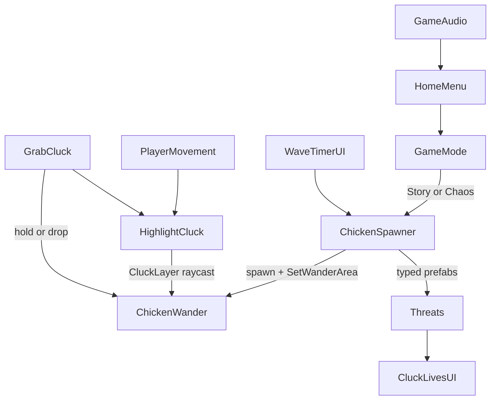

# Architecture

Unity 6 (6000.5.4f1) 2D URP project under `GMTK26 V1/`. Product name on itch: Exploding Chickens (GMTK Game Jam 2026).

## Scenes

| Scene | Role |
| ----- | ---- |
| `HomeScene` | Main menu, Story/Chaos, map select, chicken directory |
| `SampleScene` | Farm (day) |
| `World2` | Dusk |
| `World3` | Graveyard |

Flow: `HomeMenu` / `MapSelectUI` write `GameMode` PlayerPrefs, then `SceneFader` loads a world. Combo Story can open a `LevelPortal` (`Gate`) to the next map.

## High-level loop

## Core player stack (Farmer)

| Script | Responsibility |
| ------ | -------------- |
| `PlayerMovement` | Input System move, flip, `Running`, footsteps, Chaos vertical lane |
| `HighlightCluck` | Short raycast on `CluckLayer`; `Highlight` anim bool |
| `GrabCluck` | Space/E grab and drop; held laser/gun fire; `ForceGrab` for Chaos/boss |

## Flock and spawning

| Script | Responsibility |
| ------ | -------------- |
| `ChickenWander` | Shared AI: wander/idle, flee, Mind attract, bomb approach normals, panic sprint, ghost chase, alien gravity freeze, boss huddle/march |
| `ChickenSpawner` | Opening flock, story waves (endless on single-map Story), Chaos rush, unlocks, caps, finish portal, game over |

Always use `SetWanderArea` after spawn. Spawner also assigns `farmerTransform` and optional world speed via `MultiplyMoveSpeed`.

`RefreshTypeFlags()` detects marker/behavior components so one wander script serves every chicken prefab.

Per-map chicken lists and unlock waves for the home UI: `MapRoster` (must stay aligned with each scene's spawner). Full roster: [CHICKENS.md](CHICKENS.md).

## Modes (`GameMode`)

| Mode | Behavior |
| ---- | -------- |
| Story + Combo | Timed waves through Farm then portal chain. Finish after `maxStoryWave` can explode remaining mobs and open a gate. |
| Story + single map | Endless waves with rising difficulty until flock wipe. |
| Chaos | Right-edge bomb (then electric) march; farmer left lane + gun. |

Map ids: `farm`, `dusk`, `graveyard`, `combo`.

## UI and systems

| Script | Responsibility |
| ------ | -------------- |
| `HomeMenu` / `MapSelectUI` / `MapRoster` | Mode and map pick, roster previews |
| `HowToPlayIntro` | First Story boot tutorial |
| `WaveTimerUI` | Wave timer, hints, finished banner, game over card (retry / home) |
| `CluckLivesUI` | Flock lives (including damage blink feedback) |
| `PauseMenu` | Pause on **P**; music/SFX sliders |
| `GameAudio` | BGM + SFX singleton; Resources/Music fallback loads |
| `SceneFader` | Black hold / reveal between scenes |
| `LevelPortal` | Next scene after Story finish |
| `ChickenDirectoryUI` + catalog ScriptableObjects | Bestiary text and portraits |

## Assets layout

| Path | Contents |
| ---- | -------- |
| `Assets/Scripts/` | All gameplay C# (flat; plus `Editor/`) |
| `Assets/Prefabs/` | Chickens, VFX, Gate, Gun, Missile, Lives, Spawn |
| `Assets/Animations/` | Controllers and clips per chicken / farmer / VFX |
| `Assets/Sprites/` | Farmer, UI keys, cover art, `Variety Clucks/`, `MapPreviews/`, tilesets |
| `Assets/Music/` + `Assets/Resources/Music/` | Map OSTs and ability clips |
| `Assets/Resources/ChickenDirectory/` | Directory portraits + Catalog |
| `Assets/EXPLODING_CHICKENS/` | Branding / splash pack |
| `Assets/Shaders/` | Custom shaders (e.g. haunt vision) |
| `Assets/_Recovery/` | Crash recovery only; ignore |

## Conventions

1. Prefer type components on prefabs; let `ChickenWander.RefreshTypeFlags()` drive shared AI.
2. Spawner owns wander area and farmer wiring on spawn.
3. Null-check `GetSelectedClucks()` before grab.
4. Gate player Update with `PauseMenu.IsPaused`.
5. Do not invent Animator parameters without checking controllers.
6. When adding a chicken type: prefab + script (if needed) + directory entry + `MapRoster` slot + spawner array assignment per world.
7. Ignore `Assets/_Recovery/`.
